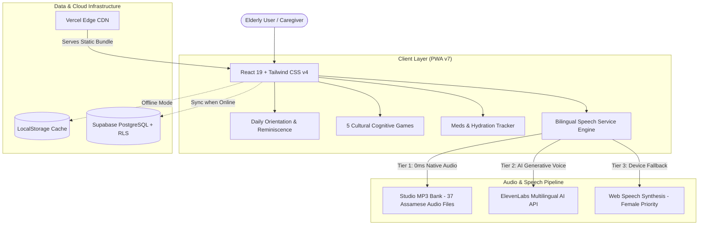

# 🌸 Smriti-NER (স্মৃতি-NER)
### Culturally-Anchored AI Cognitive Care & Memory Companion for Northeast India
**Smart India Hackathon 2026 Innovation**

[](https://smriti-ner-three.vercel.app)
[](https://smriti-ner-three.vercel.app)
[](https://smriti-ner-three.vercel.app)
[](https://smriti-ner-three.vercel.app)

*Empowering our elders (*Koka* & *Aita*) living with mild cognitive impairment and dementia across Assam and Northeast India through native-language voice guidance, cultural reminiscence, and dignity-first daily care.*

---

## 🌾 The Story Behind Smriti-NER

When dementia touches an elderly family member in rural or semi-urban Northeast India, the challenges are very different from the West:
* **The Linguistic Isolation:** Standard digital health apps only speak English or Hindi with robotic American accents. When our grandparents (*Koka* and *Aita*) experience memory lapses, hearing a foreign voice causes panic and disorientation.
* **Cultural Alienation:** Games asking elderly Indian seniors to recognize Western landmarks or solve abstract geometric math puzzles feel clinical and frustrating.
* **The Healthcare Gap:** Specialist geriatric neurologists are concentrated in major metros. Primary rural health relies on local ASHA workers and family caregivers who need simple, non-intrusive adherence monitoring.

**Smriti-NER was built from the ground up to solve this.** It is not just another reminder app; it is a warm, familiar presence that speaks in **crystal-clear native Assamese (অসমীয়া)**, celebrates their heritage (Bihu beats, tea garden routines, tribal weaving motifs), and keeps them oriented peacefully in their own homes.

---

## 🌟 Key Innovations & Features

### 1. 🎙️ Dual-Channel Studio Voice Companion
* **Studio Native Assamese (🌸 স্পষ্ট অসমীয়া কণ্ঠ):** Zero-latency pre-recorded studio audiobank for all core greetings, reminders, games, and calming stories—guaranteeing 100% authentic pronunciation without robotic distortion.
* **Warm English Lady Companion (👩):** Specifically tuned to high-warmth feminine vocal frequencies (Microsoft Zira & Sonia priority) that bring comfort and calm agitation in dementia patients.
* **Smart Language Interceptor:** If an elderly senior is in Assamese mode, the engine automatically translates and speaks all prompts in Assamese even if underlying component data passes English.

### 2. 🧠 Culturally-Grounded Cognitive Games
Traditional cognitive stimulation therapy (CST) adapted to Northeast Indian folk life:
* **স্মৃতি মেলা (Cultural Memory Match):** Match traditional Assamese instruments (*Pepa*, *Dhol*, *Gogona*, *Japi*, *Gamusa*).
* **চাহ বাগিচা (Tea Leaf Sorter):** Executive categorization game sorting tender two-leaves-and-a-bud into bamboo baskets.
* **বাঁহৰ ঢোল (Bamboo Beats):** Tactile auditory rhythm game matching the celebratory tempo of Bihu drums to stimulate motor coordination.
* **জনজাতীয় বস্ত্ৰ (Tribal Pattern Spotter):** Spatial recognition identifying authentic motifs from Mising, Bodo, Karbi, and Dimasa handlooms.
* **দৈনিক সময়ক্ৰম (Daily Routine Sequencer):** Temporal orientation exercise arranging sunrise prayers (*Namghar*), morning tea, bathing, lunch, and afternoon rest.

### 3. 🌿 Dignified Daily Living & Health Tracking
* **Daily Orientation Tile:** Always shows the day, date, time of day (Morning/Afternoon/Evening), and a comforting reminder that they are safe at home.
* **Hydration Counter with Visual Water Glass:** Simple tap-to-log tracker with celebratory Assamese praise when reaching daily hydration goals.
* **Smart Medicine Checklist:** Clear morning, afternoon, and evening pill reminders with auditory confirmation.
* **Emergency SOS & ASHA Worker Sync:** One-tap emergency call to family and local health workers with direct patient location notes.

### 4. ⚡ True Zero-Lag Offline PWA (Service Worker v7)
In rural areas of Northeast India, monsoons frequently disrupt internet connectivity. Smriti-NER installs directly on smartphones and tablets as a lightweight Progressive Web App that works **100% offline**, preserving all core audio assets and games without buffering.

---

## 🏗️ Architecture & Technology Stack



| Component | Technology | Rationale |
|---|---|---|
| **Frontend Framework** | React 19 + Vite 8 | Ultra-fast rendering, minimal bundle size, instant hot reload. |
| **Styling & Theme** | Tailwind CSS v4 | Cultural color system (Muga gold, Eri ivory, Kaziranga emerald). |
| **Icons & Visuals** | Lucide React | Clean, high-contrast, scalable SVG icons suitable for geriatric vision. |
| **Audio Synthesis** | HTML5 Audio + Web Speech API | Dual-tier local soundbank + neural voice fallback for resilient speech. |
| **Database & Auth** | Supabase (PostgreSQL) | Secure cloud adherence sync for ASHA workers with Row-Level Security. |
| **Deployment** | Vercel Edge CDN | Global low-latency static hosting with automatic SSL and PWA caching. |

---

## 🚀 Getting Started Locally

### Prerequisites
* **Node.js**: v18.0 or higher
* **npm**: v9.0 or higher

### Installation

1. **Clone the repository:**
   ```bash
   git clone https://github.com/Ajinkya-Undercovered/Smriti-NER.git
   cd Smriti-NER
   ```

2. **Install dependencies:**
   ```bash
   npm install
   ```

3. **Start the local development server:**
   ```bash
   npm run dev
   ```
   Open your browser at `http://localhost:5173`.

4. **Build for production:**
   ```bash
   npm run build
   ```
   The production-ready assets will be compiled into the `dist/` directory with automatic Service Worker asset injection.

---

## 📁 Repository Structure

```text
Smriti-NER/
├── PRD.md                     # Product Requirements & Patient Personas
├── architecture.md            # System Architecture & Technical Specifications
├── rules.md                   # AI & Engineering Guardrails (Voice, UI, Safety)
├── phases.doc.md              # Project Development Roadmap (Phases 1 to 6)
├── design.md                  # Cultural Design System, Color Tokens & Typography
├── memory.md                  # Development History & Technical Decisions Log
├── supabase_schema.sql        # Database tables for adherence & patient profiles
├── public/
│   ├── audio/voices/          # 37 Studio-recorded native Assamese MP3 audio files
│   ├── manifest.json          # Web App Manifest for mobile installation
│   └── sw.js                  # PWA Service Worker v7 (Offline cache engine)
└── src/
    ├── ai/                    # ElevenLabs neural speech service integration
    ├── components/
    │   ├── common/            # DualAudioToggle, VoiceModal, AudioHeader
    │   ├── games/             # 5 Cultural Cognitive Games (Memory, Tea, Rhythm...)
    │   ├── home/              # Senior-friendly Home Grid Hub
    │   ├── reminiscence/      # Folklore, photo albums & soothing stories
    │   └── reminders/         # Hydration & Medication Adherence Timelines
    ├── context/               # Global state (Language, Auth, Profiles)
    └── i18n/                  # Speech synthesis engine & Assamese phonetic dictionaries
```

---

## 👥 Acknowledgments & SIH 2026 Dedication

Created with deep affection and care for **Smart India Hackathon 2026**. Dedicated to the resilient elders and dedicated ASHA community health workers of Assam and Northeast India.

*Live prototype is freely accessible at:* **[https://smriti-ner-three.vercel.app](https://smriti-ner-three.vercel.app)**
